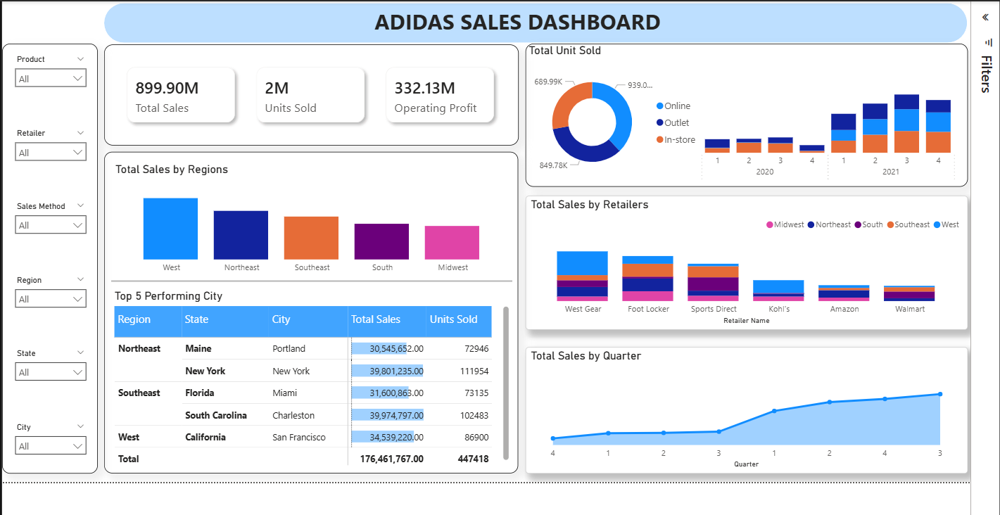

# Adidas Data Warehouse Project

This repository contains an Adidas data warehouse solution and its Power BI dashboard.

## Contents

- `Adidas_SSAS.slnx` - SQL Server Analysis Services solution.
- `AdidasDW.bak` - SQL Server database backup used to restore the warehouse.
- `dashboard/adidas dashboard.pbix` - Power BI report.
- `dashboard/powerbi_dashboard.png` - Dashboard preview image.

## Dashboard Preview

## Getting Started

1. Restore `AdidasDW.bak` in SQL Server Management Studio or another compatible SQL Server tool.
2. Open `Adidas_SSAS.slnx` in Visual Studio with the required SQL Server Data Tools and Analysis Services extensions installed.
3. Update the Power BI report's data source connection to the restored database or deployed Analysis Services model.
4. Open `dashboard/adidas dashboard.pbix` in Power BI Desktop and refresh the data.

## Requirements

- SQL Server with permission to restore and query databases.
- Visual Studio with SQL Server Data Tools and Analysis Services support.
- Power BI Desktop for viewing and refreshing the report.

## Notes

The `.bak` file is a binary database backup. Keep it in a location accessible to the SQL Server instance during restore.